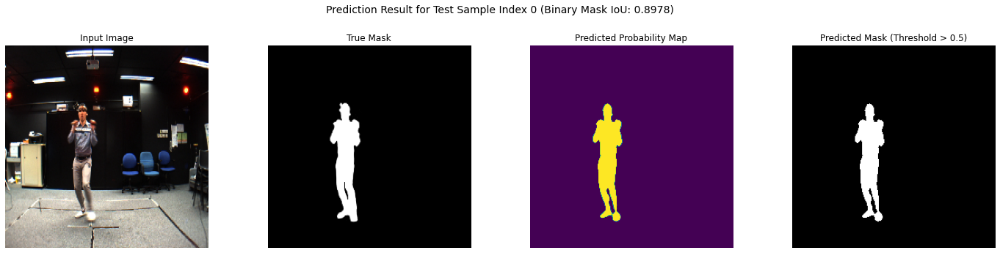
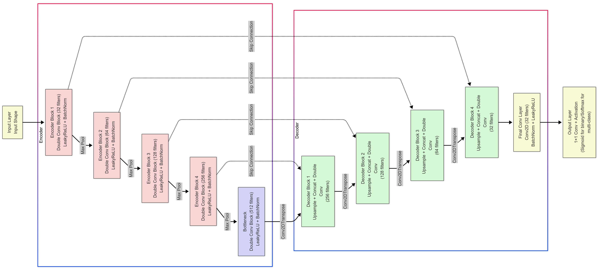
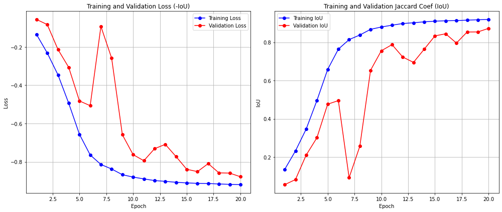

# U-Net for Full Body Segmentation

## Overview

This project implements a **U-Net model trained from scratch** for semantic segmentation of humans in images. The goal is to accurately identify and segment human figures from complex backgrounds using the **Segmentation Full Body MADS Dataset** (Martial Arts, Dancing and Sports).


*Model predictions showing (left to right): Input image, ground truth mask, predicted probability map, and final binary mask. The model effectively captures body contours and fine structures.*

---

## Project Highlights

- **Architecture**: U-Net with encoder-decoder structure and skip connections
- **Training**: Model trained from scratch (no pre-trained weights)
- **Dataset**: 1,192 studio-captured human action images from MADS dataset
- **Performance**: Achieved **IoU of 0.9022** on test set
- **Task**: Binary segmentation (person vs. background)

---

## Dataset

### MADS (Martial Arts, Dancing and Sports)

- **Source**: Visual Analysis Lab, City University of Hong Kong
- **Size**: 1,192 image-mask pairs
- **Original Resolution**: 512 × 384 pixels
- **Training Resolution**: 256 × 256 pixels (resized)
- **Actions Included**: 
  - Tai-chi
  - Kata
  - Hip-hop dance
  - Jazz dance
  - Basketball
  - Volleyball
  - Tennis
  - Badminton

### Data Split

- **Training Set**: 1,182 samples (with 20% validation split during training)
- **Test Set**: 10 samples

---

## Model Architecture

### U-Net Overview


*Complete U-Net architecture diagram showing the encoder path (pink blocks), bottleneck (center), decoder path (green blocks), and skip connections. The architecture processes 256×256×3 input images through symmetric contracting and expansive paths to produce 256×256×1 segmentation masks.*

The U-Net architecture consists of three main components:

1. **Encoder (Contracting Path)** - Pink blocks in diagram
   - Four encoder blocks with progressive downsampling
   - Each block: 2× Conv2D (3×3) → Batch Normalization → LeakyReLU → MaxPool2D (2×2)
   - Filter progression: 32 → 64 → 128 → 256
   - Spatial dimensions: 256² → 128² → 64² → 32² → 16²

2. **Bottleneck** - Center of diagram
   - Deepest layer with 512 filters at 16×16 resolution
   - Captures high-level global features
   - Connects encoder and decoder paths

3. **Decoder (Expansive Path)** - Green blocks in diagram
   - Four decoder blocks with progressive upsampling
   - Each block: Conv2DTranspose (upsampling) → Concatenate with skip connection → 2× Conv2D
   - Filter progression: 256 → 128 → 64 → 32
   - Spatial dimensions: 32² → 64² → 128² → 256²

4. **Output Layer** - Yellow block in diagram
   - Final 1×1 convolution with sigmoid activation
   - Produces pixel-wise probabilities for binary segmentation

### Key Features

- **Skip Connections**: Encoder features concatenated with decoder features to preserve spatial details
- **Batch Normalization**: Stabilizes training and speeds up convergence
- **LeakyReLU Activation**: Prevents dead neurons (α = 0.2)
- **Total Parameters**: 8,648,673 (8.64M)
  - Trainable: 8,642,721
  - Non-trainable: 5,952

---

## Training Configuration

### Hyperparameters

| Parameter | Value |
|-----------|-------|
| **Optimizer** | Adam |
| **Learning Rate** | 0.001 (1e-3) |
| **Batch Size** | 32 |
| **Epochs** | 20 |
| **Validation Split** | 20% |
| **Input Size** | 256 × 256 × 3 |
| **Output Size** | 256 × 256 × 1 |

### Loss Function & Metric

- **Loss**: Jaccard Loss (negative IoU)
  - Encourages accurate overlap between predicted and ground truth masks
  - Defined as: `-IoU` to convert maximization into minimization

- **Metric**: Intersection over Union (IoU) / Jaccard Coefficient
  ```
  IoU = |Prediction ∩ Ground Truth| / |Prediction ∪ Ground Truth|
  ```
  - Measures pixel-wise overlap between predictions and ground truth
  - Higher IoU indicates better segmentation accuracy

### Smoothing Factor

- `SMOOTH = 1.0` added to prevent division by zero in IoU computation

---

## Results

### Quantitative Performance

| Metric | Value |
|--------|-------|
| **Test Loss** | -0.9022 |
| **Test IoU (Jaccard Coefficient)** | **0.9022** |

### Training Curves


*Training and validation loss/IoU over 20 epochs. The model shows steady improvement with some validation fluctuations indicating minor overfitting on the small dataset.*

### Key Observations

- **Training Loss**: Steadily decreases from -0.1349 to -0.9195
- **Training IoU**: Improves from 0.1357 to 0.9195
- **Validation IoU**: Reaches peak of 0.8730 at epoch 20
- **Convergence**: Model converges well despite limited training data
- **Fluctuations**: Validation metrics show some variance, typical for small datasets

---


## Limitations & Future Work

### Current Limitations

- **Small Dataset**: Only 1,192 samples limits generalization
- **Simple Split**: Test set of 10 samples is very small
- **Studio Setting**: Dataset contains controlled studio backgrounds
- **Single Person**: Model trained only on single-person scenarios

### Potential Improvements

1. **Architecture Enhancements**:
   - Add attention mechanisms for better focus on limbs and fine structures
   - Explore deeper variants (U-Net++, Attention U-Net)
   - Implement multi-scale feature fusion

2. **Training Improvements**:
   - Data augmentation (rotation, flipping, color jittering)
   - Transfer learning with pre-trained encoders (ResNet, EfficientNet)
   - Larger training dataset or domain adaptation

3. **Extended Capabilities**:
   - Multi-person segmentation
   - Real-world background handling
   - Instance segmentation (separate individuals)
   - Integration with pose estimation pipelines

4. **Comparison Studies**:
   - Benchmark against Mask R-CNN
   - Compare with modern architectures (DeepLabV3+, SegFormer)
   - Evaluate on other human segmentation datasets

---

## Detailed Documentation

For complete implementation details, architecture diagrams, training logs, and step-by-step explanations, please refer to:

- **[Implementation Notebook](Team13_DS303_ProjectCode.ipynb)** - Full code with detailed comments and outputs
- **[Project Presentation](Team13_DS303_ProjectPPT.pdf)** - Overview, methodology, and results


